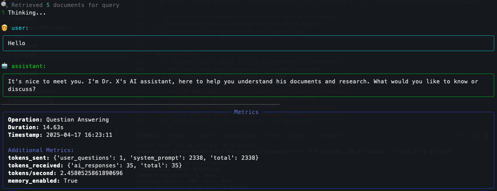

# Dr. X Document Analysis Suite

## Project Overview



This project aims to analyze a collection of research publications left behind by the mysteriously vanished Dr. X. The publications are in various formats (.pdf, .docx, .csv, .xlsx, etc.). As an NLP specialist, the goal is to process these documents, extract meaningful information, and build tools to understand Dr. X's research, potentially uncovering clues about their disappearance.

The core components include:

1. **Document Loading:** Extracting text from diverse file formats, including handling tables.
2. **Text Chunking:** Breaking down large documents into manageable pieces.
3. **Vector Embedding:** Creating numerical representations of text chunks for semantic understanding.
4. **Vector Database:** Storing and retrieving embeddings efficiently.
5. **RAG Q&A System:** Answering user questions about the documents using Retrieval-Augmented Generation.
6. **Translation Tool:** Translating documents between languages (English/Arabic).
7. **Summarization Tool:** Generating concise summaries of the publications.
8. **Evaluation:** Measuring the performance and quality of the generated summaries and the efficiency of NLP processes.

This system utilizes local LLMs and vector databases to ensure offline capabilities and data privacy.

## Features

-   **Multi-Format Document Loading:** Ingests and extracts text from `.pdf`, `.docx`, `.csv`, `.xlsx`, `.xls`, and `.xlsm` files using `EnhancedDocumentLoader`.
-   **Intelligent Table Extraction:** Extracts text from tables within documents and formats it into readable sentences (`_format_table`).
-   **Advanced Text Chunking:**
    -   Splits documents using the `cl100k_base` tokenizer.
    -   Offers `recursive` character splitting.
    -   Includes an `agented` strategy using an LLM for semantic chunking.
    -   Records metadata for each chunk (source file, page/row number, chunk ID).
-   **Vector Embeddings:** Generates vector embeddings for text chunks using the `nomic-ai/nomic-embed-text-v1` model via `SentenceTransformer`.
-   **Local Vector Database:** Stores chunks and their embeddings in a persistent `ChromaDB` database for efficient semantic search.
-   **RAG Q&A System:**
    -   Allows users to ask questions about the documents.
    -   Retrieves relevant chunks from ChromaDB based on semantic similarity to the question.
    -   Uses a local model (via Ollama) to generate answers based on the retrieved context.
    -   Supports conversational context (remembers previous questions/answers).
-   **Multi-Lingual Translation:** Translates document content between English and Arabic using a local LLM, attempting to preserve original formatting.
-   **Document Summarization:**
    -   Generates summaries using various methods (`map_reduce`, `refine`, `rerank`).
    -   Allows experimentation with different prompt strategies (`default`, `analytical`, `extractive`).
    -   Optionally uses K-Means clustering on document embeddings to group similar sections before summarizing.
    -   Includes t-SNE visualization for document clusters.
-   **Summary Evaluation:** Evaluates generated summaries against reference summaries using ROUGE metrics (`rouge1`, `rouge2`, `rougeL`).
-   **Performance Monitoring:** Records and logs "tokens per second" for key LLM operations (embedding, RAG, translation, summarization) using a custom `Logger`.
-   **Interactive CLI:** Uses `inquirer` for user-friendly selection of options, files, and strategies.
-   **Rich Logging:** Provides detailed and structured console output and file logging using `rich` and a custom `Logger` class.

## Technology Stack

-   **Programming Language:** Python 3.x
-   **Core NLP/ML Libraries:**
    -   `langchain`: Framework for building LLM applications (RAG, Summarization Chains).
    -   `sentence-transformers`: For loading and using the embedding model.
    -   `tiktoken`: Tokenizer (`cl100k_base`) for chunking and token counting.
    -   `chromadb`: Local vector database.
    -   `ollama` (via `langchain-ollama`): Interface for running local LLMs.
    -   `rouge-score`: For evaluating summary quality.
    -   `scikit-learn`: For K-Means clustering.
-   **Document Processing:**
    -   `pypdf2` / `fitz` (PyMuPDF): For PDF text and table extraction.
    -   `python-docx`: For DOCX text and table extraction.
    -   `pandas`: For reading and processing CSV and Excel files.
    -   `openpyxl`: Required by pandas for `.xlsx` files.
-   **Local Models:**
    -   **LLM:** llama3.1 (or other models configured in `config.py` and available via Ollama). _Obtained by running `ollama pull llama3.1`._
    -   **Embedding Model:** `nomic-ai/nomic-embed-text-v1`. _Obtained automatically via the `sentence-transformers` library._
-   **CLI & Logging:**
    -   `rich`: For enhanced terminal output formatting (panels, tables, progress bars).
    -   `inquirer`: For interactive command-line prompts.
    -   `colorama`: Cross-platform colored terminal text.
-   **Visualization:**
    -   `matplotlib`: For plotting t-SNE cluster visualizations.

## Directory Structure

```
./
├── Dr.X Files/              # Directory containing input documents
│   └── ... (example.pdf, research.docx, data.xlsx)
├── chroma_store/            # Persistent storage for ChromaDB vector database
│   └── ...
├── logs/                    # Directory for log files and evaluation results
│   ├── app.log
│   ├── chunking.log
│   ├── clustering.log
│   ├── embedding.log
│   ├── evaluation.log
│   ├── loader.log
│   ├── rag_pipeline.log
│   ├── summarizer.log
│   ├── translation.log
│   ├── vector_db.log
│   ├── evaluation_results/  # Stores ROUGE evaluation outputs (CSV, JSON)
│   │   └── ...
│   └── visualizations/      # Stores t-SNE cluster plots and content files
│       └── ...
├── modules/                 # Core application logic modules
│   ├── chunker.py
│   ├── embedder.py
│   ├── evaluation.py
│   ├── file_loader.py
│   ├── rag_qa.py
│   ├── summarizer.py
│   ├── translator.py
│   └── vector_db.py
├── utils/                   # Utility functions and classes
│   ├── logger.py
│   └── tools.py
├── translation_output/      # Directory for translated document outputs
│   └── ...
├── summary_files_organic/   # Directory for reference summaries (used by evaluation)
│   └── ... (example.pdf.txt, research.docx.txt)
├── config.py                # Configuration settings for the application
├── main.py                  # Main entry point for the application
├── requirements.txt         # Python dependencies
└── README.md                # This file
```

_(Note: You might need to create the `Dr.X Files`, `summary_files_organic`, and `translation_output` directories manually if they don't exist)._

## Setup and Installation

1. **Clone the Repository:**

    ```bash
    git clone <your-repository-url>
    cd <repository-directory>
    ```

2. **Create a Virtual Environment (Recommended):**

    ```bash
    python -m venv venv
    source venv/bin/activate  # On Windows use `venv\Scripts\activate`
    ```

3. **Install Dependencies:**
   Ensure you have a `requirements.txt` file listing all necessary libraries (like `langchain`, `sentence-transformers`, `chromadb-client`, `langchain-ollama`, `tiktoken`, `pypdf2`, `python-docx`, `pandas`, `openpyxl`, `rich`, `inquirer`, `rouge-score`, `scikit-learn`, `matplotlib`, `colorama`, `PyMuPDF`).

    ```bash
    pip install -r requirements.txt
    ```

4. **Install Ollama:**
   Follow the instructions on the [Ollama website](https://ollama.com/) to install Ollama for your operating system.
5. **Pull the LLM Model:**
   Download the llama3.1 model (or the default model specified in `config.py`):

    ```bash
    ollama pull llama3.1
    ```

    Ensure the Ollama application/server is running in the background when you use the application.

6. **Prepare Documents:**
   Place Dr. X's publication files (`.pdf`, `.docx`, `.csv`, `.xlsx`, etc.) into the `Dr.X Files` directory (or the directory specified in `config.py`).
7. **(Optional) Prepare Reference Summaries:**
   If you plan to use the Summary Evaluation feature, create reference summary text files (`.txt`) in the `summary_files_organic` directory. The filename should match the original document's filename (e.g., `research.docx.txt` for `research.docx`).

## Configuration

The main configuration settings are located in `config.py`. You can modify this file to change:

-   `DOCUMENT_SETTINGS`: Path to the input documents directory.
-   `CHUNKING_SETTINGS`: Default chunking strategy, chunk size, overlap.
-   `EMBEDDING_SETTINGS`: Name of the embedding model.
-   `VECTOR_DB_SETTINGS`: Path for the persistent vector store, collection name.
-   `LLM_SETTINGS`: Default LLM model name (must match an Ollama model), context window, max output tokens, temperature.
-   `PROMPT_STRATEGIES`: Templates used for different summarization approaches.
-   `RAG_SETTINGS`: Number of results to retrieve, chat history usage.
-   `TRANSLATION_SETTINGS`: Default translation model.
-   `SUMMARIZER_SETTINGS`: Whether to enable clustering by default.
-   `UI_SETTINGS`: Welcome messages, exit commands.
-   `SYSTEM_PROMPT_TEMPLATE`: The base prompt used for the RAG Q&A system.
-   Log file paths for different modules.

## Usage

Run the main application script from the terminal:

```bash
python main.py
```

This will present an interactive menu:

```
=== Dr.X Document Analysis Suite ===
? Select an option:  (Use arrow keys)
 » 1. Starting RAG QA
   2. Starting Translation - English
   3. Starting Translation - Arabic
   4. Starting Main Ideas extraction
   5. Starting Summary evaluation
```

Select an option using the arrow keys and press Enter.

1. **RAG QA:** Initializes the document processing pipeline (loading, chunking, embedding, vector store creation – if not already done) and starts an interactive chat session where you can ask questions about the documents. Type 'exit' to quit the chat. Allows selection between `recursive` and `agented` chunking strategies upon first run or when the database is empty.
2. **Translation (English/Arabic):** Prompts you to select a file from the `Dr.X Files` directory and translates its content to the target language (English or Arabic). The translated text is saved chunk-by-chunk to a file in the `translation_output` directory.
3. **Main Ideas Extraction (Summarization):** Prompts you to select a file, a summarization method (`map_reduce`, `refine`, `rerank`), a prompt strategy (`default`, `analytical`, `extractive`), and a chunking strategy (`recursive`, `agented`). It generates a summary of the selected file using the chosen settings and logs performance metrics. If reference summaries exist, it also performs ROUGE evaluation.
4. **Summary Evaluation:** Allows you to manually input a generated summary and a reference summary to calculate and display ROUGE scores. Results are saved to the `logs/evaluation_results` directory.

## Methodology

-   **File Loading (`file_loader.py`):** Uses specific libraries (`PyMuPDF`, `python-docx`, `pandas`) to handle different file types. Tables are identified, and their content is converted into a structured sentence format (`_format_table` in `utils/tools.py`) to improve semantic understanding by the LLM. Documents are often split into page-based or row-based `Document` objects.
-   **Chunking (`chunker.py`):**
    -   `RecursiveCharacterTextSplitter` (Langchain): Splits text based on characters (`\n\n`, `\n`, ), trying to keep paragraphs/sentences together, using token count limits (`cl100k_base`).
    -   `Agented Chunking`: Uses the LLM itself to semantically divide the text into meaningful chunks based on content coherence. Structured data (CSV/Excel rows) are treated as individual chunks.
-   **Embedding (`embedder.py`):** The `nomic-ai/nomic-embed-text-v1` model (via `SentenceTransformer`) converts text chunks into dense vector representations.
-   **Vector Store (`vector_db.py`):** `ChromaDB` stores the embeddings and corresponding text chunks locally. It uses cosine similarity (specified in metadata) to find chunks semantically similar to a query embedding.
-   **RAG (`rag_qa.py`):**
    1. **Retrieve:** Embeds the user's question using the Nomic model. Queries ChromaDB to find the top `n_results` most similar chunks.
    2. **Augment:** Constructs a context string from the retrieved chunks. Formats a detailed prompt (using `SYSTEM_PROMPT_TEMPLATE`) including the context, chat history (if enabled), and the user's question.
    3. **Generate:** Sends the augmented prompt to the local llama3.1 model via Ollama to generate a context-aware answer.
-   **Translation (`translator.py`):** Chunks the input document and sends each chunk to the LLM with a prompt instructing it to translate to the target language while preserving formatting.
-   **Summarization (`summarizer.py`):**
    -   Uses Langchain's `load_summarize_chain` with different strategies:
        -   `map_reduce`: Summarizes chunks individually, then combines summaries. Good for large documents.
        -   `refine`: Iteratively refines a summary based on subsequent chunks. Good for context.
        -   `rerank` (custom implementation): Summarizes small chunks individually and ranks them based on length/density to select the most informative ones.
    -   Applies different prompt templates (`map_template`, `combine_template`) based on the chosen strategy (`default`, `analytical`, `extractive`).
    -   Optionally performs K-Means clustering on embeddings before summarization to group related content. Visualizes clusters using t-SNE.
-   **Evaluation (`evaluation.py`):** Uses the `rouge-score` library to compute ROUGE-1, ROUGE-2, and ROUGE-L (F1, Precision, Recall) comparing generated summaries to reference texts.
-   **Performance (`logger.py`):** Wraps key operations with timing functions and calculates tokens processed per second for LLM-intensive tasks.

## Evaluation Metrics

-   **Summarization Quality:** ROUGE-1, ROUGE-2, ROUGE-L (F1-score, Precision, Recall) are calculated when comparing generated summaries against reference summaries (using `SummaryEvaluator`). Results are logged and saved in `logs/evaluation_results`.
-   **System Efficiency:** Tokens per second (Tokens/sec) are measured and logged for LLM interactions during RAG, translation, and summarization steps to gauge processing speed.

## Creative Enhancements & Advanced Features

-   **Agent-Based Chunking:** An alternative chunking strategy using the LLM for potentially more semantically meaningful chunks.
-   **Enhanced Table Formatting:** Tables are not just extracted as text blocks but are formatted into descriptive sentences, making their content more accessible to the LLM.
-   **Cluster Visualization:** t-SNE visualization helps understand the thematic grouping of document chunks when clustering is enabled for summarization. Cluster contents are also saved to a text file.
-   **Multiple Summarization Strategies:** Support for `map_reduce`, `refine`, and `rerank` along with distinct prompt strategies allows experimentation to find the best summary type for different needs.
-   **Rich Interactive CLI:** User-friendly interface using `rich` for better display and `inquirer` for selections.
-   **Comprehensive Logging:** Detailed logging for each module, including performance metrics, aids debugging and analysis.
-   **Broad File Format Support:** Handles common academic and data formats including PDFs, Word documents, and various spreadsheet types.
